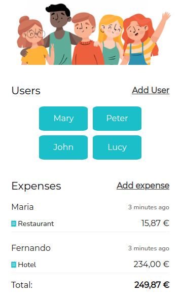

# Frontend Challenge

In this repository you will find the source code as a front-end challenge.

🌎 **Website**: https://github.com/yosiris-m/SharedExpenses

## ✅ Requirements

- Show the shared expenses of a group of friends. 
- For each expense show the following information:
  - Person who made the payment
  - Payment amount
  - Description of the payment
  - Payment date
- The expenses list must be sort by payment date in descending order.
- Add a person to the group of friends.
- Add a payment.
- Balance table to know how much money they owe or are owed.

## 🛠️ Build with

- [NodeJS](https://nodejs.org)
- [TypeScript](https://create-react-app.dev/docs/adding-typescript)
- [React](https://create-react-app.dev)
- [React Router](https://reactrouter.com)
- [moment](https://momentjs.com)
- [react-moment](https://github.com/headzoo/react-moment)
- [prettier](https://prettier.io)
- [gh-pages](https://github.com/tschaub/gh-pages)
- [SASS](https://create-react-app.dev/docs/adding-a-sass-stylesheet)
- [Font Awesome](https://fontawesome.com/)
- [WebStorm](https://www.jetbrains.com/webstorm/)

## 💻️ Development

This project was bootstrapped with [Create React App](https://github.com/facebook/create-react-app).

### Available Scripts

In the project directory, you can run:

### `npm start`

Runs the app in the development mode.\
Open [http://localhost:3000](http://localhost:3000) to view it in the browser.

The page will reload if you make edits.\
You will also see any lint errors in the console.

### `npm run build`

Builds the app for production to the `build` folder.\
It correctly bundles React in production mode and optimizes the build for the best performance.

The build is minified and the filenames include the hashes.\
Your app is ready to be deployed!

See the section about [deployment](https://facebook.github.io/create-react-app/docs/deployment) for more information.

### `npm run deploy`

Builds the app for production and publishes everything from the `build` folder to the `gh-pages` branch.
